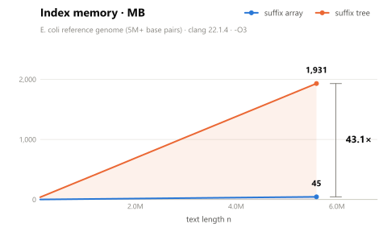
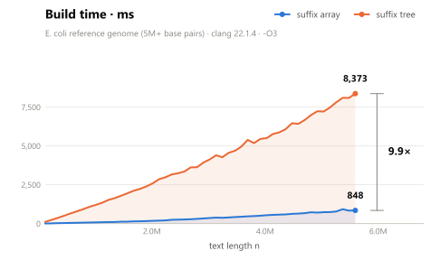
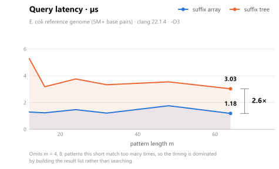

# Benchmark — suffix array vs. suffix tree

Both structures index a text in O(n) and answer "where does this pattern occur"
exactly. They differ in what that costs. `SwampBench` measures the three axes
they actually trade against each other:

- **build time** — how long constructing the index takes
- **index memory** — heap held by the index, *excluding* the text (both share it)
- **query latency** — average time per `search()` call

## Building and running

The benchmark is off by default so it costs nothing in a normal or test-only
build:

```Bash
cmake -B build -DCMAKE_BUILD_TYPE=Release -DSWAMP_BUILD_TUI=OFF -DSWAMP_BUILD_TESTS=OFF -DSWAMP_BUILD_BENCH=ON
cmake --build build --parallel
./build/bin/SwampBench > results.csv
```

Always measure a **Release** build. A Debug suffix tree is dominated by
`std::unordered_map` iterator checking and tells you nothing useful.

## Options

| Flag | Default | Effect |
|---|---|---|
| `--fasta PATH` | *(none)* | Index a real genome instead of a synthetic one. Header lines are dropped and only `ACGT` is kept. |
| `--max-size N` | `1000000` | Largest text length measured. With `--fasta`, clamped down to the file's length. |
| `--steps N` | `5` | Number of points in the scaling sweep (`n = max-size × step / steps`). |
| `--queries N` | `1000` | Patterns timed per measurement. |
| `--seed N` | `20240817` | Seeds both text generation and pattern sampling. |

The default text is uniform random `ACGT`, which is reproducible across machines
from the seed alone — the same seed gives byte-identical input everywhere. Real
genomes are not uniform, so use `--fasta` when you care about the effect of
repeat structure:

```Bash
./build/bin/SwampBench --fasta build/bin/ecoli.fna --max-size 500000
```

## Output format

The CSV goes to **stdout** and progress messages go to **stderr**, so
`SwampBench > results.csv` captures exactly the data and nothing else.

Rows are tidy — one measurement each — so new metrics can be added without
breaking existing parsers:

```
experiment,structure,x,metric,value
```

| Column | Values |
|---|---|
| `experiment` | `scaling` (x = text length n) or `query` (x = pattern length m) |
| `structure` | `array` or `tree` |
| `x` | n for `scaling`, m for `query` |
| `metric` | `build_ms`, `memory_bytes`, `query_us`, `total_hits`, `node_count` |

Two experiments run per invocation:

- **scaling** — rebuilds both indexes at each n, with a fixed pattern length of
  20. This is where build time and memory come from.
- **query** — builds both indexes *once* over the full text, then sweeps pattern
  length m over 4, 8, 12, 16, 24, 32, 48, 64. This isolates query cost from
  build cost.

`total_hits` is not a performance number, it is the correctness check. Every
pattern is sampled *from the text being searched*, so each one must match at
least once — and the two structures must always report the **same** total. A run
where they disagree is a bug in one of them, which is the same property the
differential unit tests assert.

## Results

Reference run in [`results/ecoli-50.csv`](results/ecoli-50.csv): the full E. coli
reference genome (5,594,605 bases after filtering to ACGT), 50-step sweep,
1,000 queries per point, clang 22.1.4 `-O3`.

| | Suffix array | Suffix tree | |
|---|---|---|---|
| Memory | 44.8 MB | 1,931 MB | **43.1× larger** |
| Build time | 848 ms | 8,373 ms | **9.9× slower** |
| Query (m = 64) | 1.18 µs | 3.03 µs | **2.6× slower** |

### Memory

<picture>
  <source media="(prefers-color-scheme: dark)" srcset="results/memory-dark.svg">
  
</picture>

Both are linear in n, as O(n) construction requires — the constant factor is the
whole story. The array is exactly 8 bytes per base; the tree needs ~345.

### Build time

<picture>
  <source media="(prefers-color-scheme: dark)" srcset="results/build-dark.svg">
  
</picture>

### Query latency

<picture>
  <source media="(prefers-color-scheme: dark)" srcset="results/query-dark.svg">
  
</picture>

| m | Array | Tree | Hits per query |
|---|---|---|---|
| 4 | 1,466 µs | 7,045 µs | 25,287 |
| 8 | 6.40 µs | 35.26 µs | 129 |
| 12 | 1.29 µs | 5.28 µs | 2.0 |
| 16 | 1.23 µs | 3.18 µs | 1.2 |
| 32 | 1.21 µs | 3.33 µs | 1.2 |
| 64 | 1.18 µs | 3.03 µs | 1.1 |

Below m = 12 a pattern matches so often that both structures are bound by
*materializing* the occurrence list rather than finding it — at m = 4 every
4-mer occurs ~25,000 times in this genome. Those rows measure
`collectLeaves`/array-slice throughput, not search, which is why the chart omits
them. From m = 16 up the patterns are effectively unique and latency flattens.

E. coli is real DNA and therefore repetitive, so short patterns match far more
often here than in the synthetic run — the crossover to "effectively unique"
sits at m = 12 rather than m = 8.

## Regenerating the charts

[`render_charts.py`](render_charts.py) turns a results CSV into the SVGs above.
It needs matplotlib and nothing else:

```Bash
pip install matplotlib
python bench/render_charts.py bench/results/ecoli-50.csv
```

It writes `<metric>-light.svg` and `<metric>-dark.svg` next to the CSV, one pair
per metric so each chart can be linked on its own. The two themes exist because
GitHub renders a README on a white canvas *and* a near-black one; the pair is
joined with `<picture>` so the right one loads:

```html
<picture>
  <source media="(prefers-color-scheme: dark)" srcset="results/memory-dark.svg">
  
</picture>
```

The figures are transparent rather than painting their own background, so they
stay seamless on GitHub's dimmed and high-contrast themes too.

Which pattern lengths appear in the query chart is derived from the data, not
hardcoded: any m whose hit count is far above the large-m baseline is dropped,
because those points measure list-building rather than search. On a more
repetitive text that threshold moves on its own.

## Interpretation

The suffix tree loses on **all three** axes here. That is worth stating plainly
because it is not the textbook expectation: the tree's O(m) search is supposed
to buy something over the array's O(m log n). It does not, at this scale.

The cause is the per-node `std::unordered_map<int64_t, int64_t>` child map. On
the E. coli genome the tree allocates 9.2M nodes for 5.6M bases, and each one
carries a separate hash table for a DNA alphabet with only **four** possible
children — about 209 bytes per node. That map both inflates memory (it dominates
the 1,931 MB) and destroys locality on descent: every edge step is a hash lookup
into a distinct heap allocation, while the array's binary search walks one
contiguous block.

The change most likely to close the gap is replacing the map with a fixed 4-way
child array. That trades a hash table per node for 4 indices per node, and turns
each descent step into a single indexed load.

Until then, on this workload the suffix array is the better structure - it is
not a speed-for-memory trade, it is strictly ahead.

## CI

The `benchmark` job in [`../.github/workflows/ci.yml`](../.github/workflows/ci.yml)
runs a deliberately small sweep:

```Bash
SwampBench --max-size 200000 --steps 4 --queries 200 > bench_results.csv
```

That stays inside a normal CI budget (~1 s) and uploads the CSV as an artifact,
so the tradeoff is tracked across commits rather than measured once and
forgotten. The benchmark is intentionally **not** registered with CTest —
it measures, it does not assert, so a slow runner can never produce a red build.
